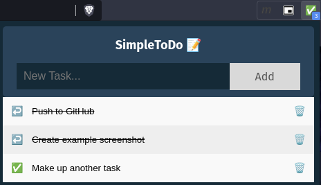

# SimpleToDo 📝
Straight-forward, no-frills, in-browser to-do list.

## Installation From Repo
1. `git clone https://github.com/mattravenhall/SimpleToDo.git`
2. Open a Chromium-based browser (Chrome, Brave, etc.)
3. Navigate to `Extensions` ➡️ `Developer mode` ➡️ `Load unpacked` ➡️ Select this directory

For more info: https://developer.chrome.com/docs/extensions/mv3/getstarted/#unpacked
